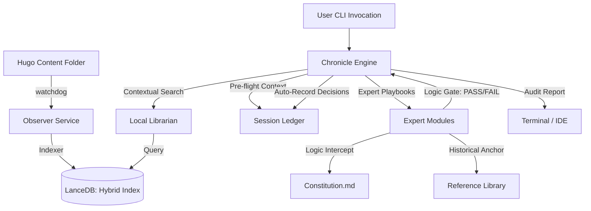

# System Architecture: Chronicle AI

## 1. Overview
Chronicle AI implements a local-first auditing loop. The local machine manages the ground truth (history, logic, scoped intent), acting as a CI/CD pipeline for your prose to validate technical constraints and narrative consistency.

## 2. Component Diagram

## 3. Core Architectural Patterns

### 3.1. Manual Invocation & Contextual Verification
- **Pattern:** The tool is invoked manually via the CLI or editor extensions to verify content.
- **Inference:** Extracts context from the draft being audited to cross-reference with history.
- **Verification:** Runs searches and checks against the Ledger to ensure consistency.

### 3.2. Externalized Logic (Playbooks)
- **SOP Directory:** `data/guardians/` contains Markdown files defining the mandate and checkpoints for each Expert Module.
- **Dynamic Loading:** `BaseGuardian` reads these files at runtime, allowing the user to tune the intelligence without touching code.

### 3.3. Hybrid Semantic Indexing
- **Mechanism:** Dual-index retrieval using semantic vectors and Full-Text Search.
- **Fusion:** Manual Reciprocal Rank Fusion (RRF) ensures technical term precision.
- **Structure:** Portable project-relative paths resolved via PathResolver.

### 3.4. Tiered Governance (Three-Scope Logic)
- **Global:** constitution.md (Engineering Principles).
- **Regional:** SessionLedger filtered by --series (Thematic Consistency).
- **Local:** SessionLedger tracked by session (Drafting Intent).

### 3.5. Link Topology & Semantic Recommendations
- **Deterministic Graph Modeling:** Parses both standard Markdown links and Hugo template shortcodes (`ref`/`relref`), translating them into a unified directed graph mapping link topology. Identifies orphan pages and flags broken internal target paths.
- **Link Recommendation Engine:** Performs semantic similarity lookups on local vector indexes for drafts, automatically filtering out the draft itself and pre-existing graph links to suggest fresh, non-obvious internal cross-linking opportunities.

## 4. Security & Privacy
- **Sovereign Reasoning:** Private logic, history, and mandates remain on local hardware.
