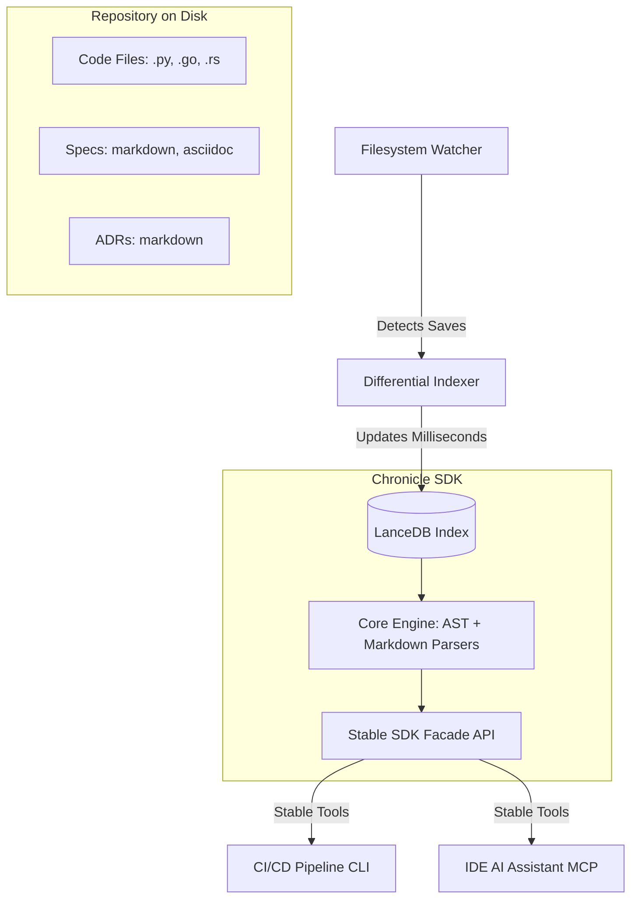

# Vision: Continuous Code & Documentation Alignment (Doc-Ops)

This document outlines the strategic vision of expanding Chronicle's local-first narrative intelligence from blog posts to a production-grade software environment, indexing **Code, Specifications, and Architectural Decision Records (ADRs)** to prevent documentation rot.

---

## 1. The Core Problem: Documentation Rot
In software engineering, documentation is a write-once, rot-forever asset. The moment a codebase is modified, existing design documents, specs, and API guidelines begin drifting out of sync. 

Standard LLM solutions fail here because they suffer from:
1. **Context Window Limits:** Copy-pasting a full repository is expensive, slow, and leads to attention loss or hallucinations.
2. **Static Memory:** The LLM's internal weights do not match the live state on disk.
3. **Split-Brain Scenarios:** The developer's interactive IDE assistant and the automated CI/CD pipeline evaluate code using diverging rules, creating friction.

---

## 2. The Solution: Permanent, Live Semantic Indexing
Instead of feeding the entire repository into a prompt, we maintain a **permanent, always up-to-date semantic index** of code tokens (ASTs), requirements (specs), and narrative choices (ADRs).

### 2.1. Differential Real-Time Updates
By utilizing the filesystem observer (`watch`) and differential indexing, the local database updates in milliseconds when a file is saved. The AI's context always reflects the exact state of the repository.

### 2.2. Surgical Documentation Updates
Instead of generating complete documents (which destroys human-written context and is token-intensive), the AI client queries the index to find the **exact paragraph or code block that has drifted**. It performs a surgical, localized rewrite, keeping the rest of the documentation untouched.

---

## 3. The AI-Agent-as-SDK-Client Interface (Parnas's Filter)
To maintain modularity and prevent system fragility, the AI client does not access the database directly or write raw SQL/LanceDB queries. We enforce a **strict API boundary**:

1. **The Core Engine (Tier 1):** Encapsulates the AST parsing, markdown headers, and vector similarity calculations.
2. **The Facade SDK (Tier 2):** Exposes clean, stable, high-level Python functions (e.g. `verify_alignment(pr_diff) -> AlignmentReport`).
3. **The MCP Server (Tier 3):** Exposes the SDK facade directly to the AI as standard JSON-RPC tools, preventing database schema leakage and ensuring strict sandbox safety.

This guarantees that the **automated CI/CD checks (via CLI)** and the **interactive developer workspace assistant (via MCP)** evaluate the codebase and specifications against the exact same rules.
